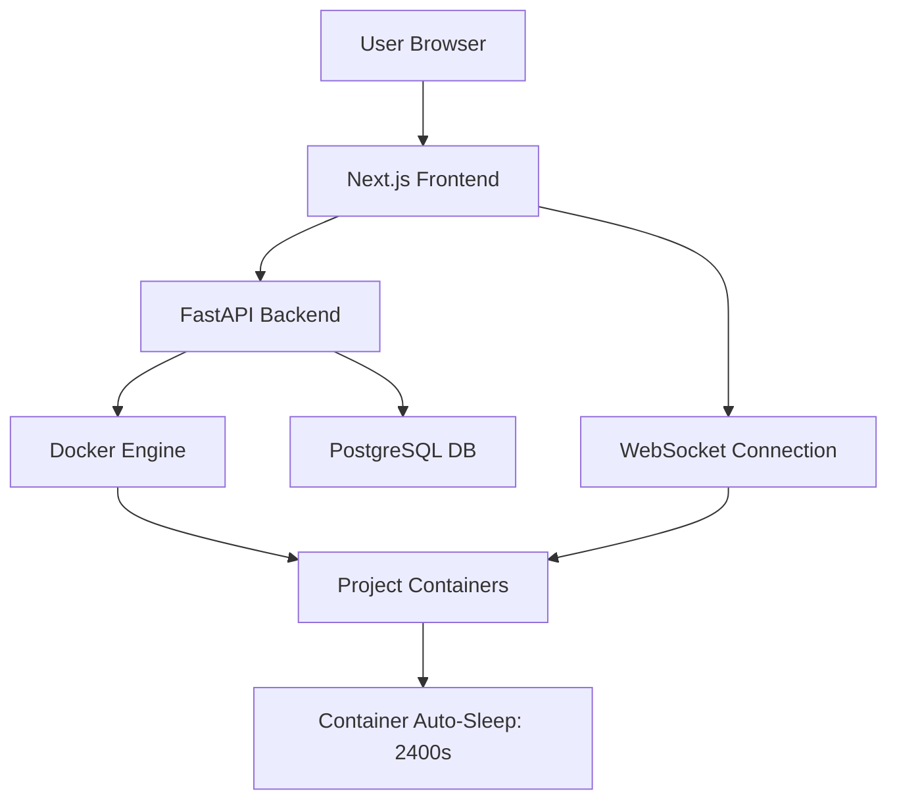

# Architecture

## Overview
A cloud-based development platform that provides isolated containerized environments for full-stack projects. Users can select their tech stack, write code in a browser-based editor, and interact with their development environment through an integrated terminal.

## Current Status
**Version:** 0.2.0 (MVP)  
**Status:** Active Development

## System Architecture

### High-Level Components


### Component Breakdown

**Frontend (Next.js)**
- Monaco Editor for code editing
- Terminal emulator for container shell access
- Context menu for file operations
- Project management UI

**Backend (FastAPI)**
- RESTful API for project CRUD
- Dynamic Dockerfile generation
- Container lifecycle management
- WebSocket server for real-time terminal/execution

**Database (PostgreSQL)**
- User accounts & authentication
- Project metadata (user_id FK, container_id, status)
- Service configurations

**Infrastructure (Docker)**
- One container per project
- Auto-generated with selected services (Node.js, Python, Go, databases)
- 40-minute idle timeout (2400s)
- Alpine-based images for efficiency

## Tech Stack

| Layer | Technology |
|-------|------------|
| Frontend | Next.js, React, Monaco Editor, WebSockets |
| Backend | FastAPI, Python 3.13, asyncpg |
| Database | PostgreSQL |
| Infrastructure | Docker |
| Real-time | WebSocket connections |

## Data Flow

### Project Creation
1. User selects services (backend, frontend, database)
2. Frontend POST `/projects/create`
3. Backend generates Dockerfile dynamically
4. Docker builds image → returns SHA256 hash
5. Container ID stored in `projects` table
6. Frontend receives project_id

### Code Editing
1. User opens project → Monaco editor loads
2. User edits code in browser
3. WebSocket sends changes to container
4. *[File persistence in development]*

### Terminal Access
1. WebSocket connection established to container
2. User inputs commands in frontend terminal
3. Commands executed in container shell
4. Output streamed back via WebSocket

## Database Schema

### `projects` table
```sql
- project_id (UUID, PK)
- user_id (UUID, FK)
- name (VARCHAR)
- status (VARCHAR) - 'active', 'sleeping', etc.
- container_id (TEXT) - Docker SHA256 hash
- created_at (TIMESTAMP)
- updated_at (TIMESTAMP)
```

### `users` table
```sql
- user_id (UUID, PK)
- [auth fields]
```

## Key Design Decisions

**Why Docker containers per project?**
- Complete isolation between user projects
- Users can't accidentally break other projects
- Easy cleanup and resource management

**Why 40-minute timeout?**
- Balances resource usage with user experience
- Prevents abandoned containers from consuming resources
- Long enough for active development sessions

**Why TEXT for container_id instead of UUID?**
- Docker returns SHA256 hashes (71 chars)
- Not compatible with UUID format (32-36 chars)
- Need to store exact Docker image reference

**Why Alpine Linux base images?**
- Smaller image sizes → faster builds
- Lower resource consumption
- Still has package manager for dependencies

## Security Model

- **Authentication:** User accounts with session management
- **Authorization:** Foreign key checks (user_id) before project access
- **Isolation:** One container per project, no shared filesystems
- **Container Security:** Alpine base, minimal packages, auto-timeout

## Directory Structure
```
/frontend          # Next.js application
  /components      # React components
  /pages           # Next.js routes
  
/backend           # FastAPI services
  /routers         # API endpoint routers
    /projects      # Project management endpoints
  /models          # Database models
  /services        # Business logic
```

## In Development

### File Persistence
- Currently: Code edits stored temporarily in container
- Planned: Persistent storage solution for user code

### Code Execution
- Currently: Terminal access only
- Planned: "Run" button to execute code and see output

### Port Forwarding / Preview
- Currently: No way to preview running applications
- Planned: Expose container ports for web app previews

## Future Considerations

- **Multiplayer Mode:** Collaborative editing (not currently planned)
- **Container orchestration:** Move to Kubernetes for scale?
- **Resource limits:** CPU/memory quotas per user
- **Backup/Export:** Download project as ZIP
- **Templates:** Pre-configured project starters

## Known Limitations

- Container timeout requires manual restart
- No file persistence across sessions yet
- Limited to Alpine-compatible packages
- Windows/Mac Docker differences (schema sync issues)

## Development Environment Setup

[Add your setup instructions here]